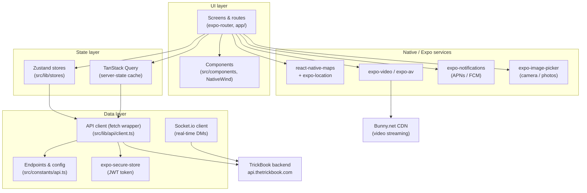

# TrickBook

Track your tricks, find spots, and ride with your crew — the TrickBook mobile app for iOS and Android.


## Overview

TrickBook is a skateboarding (and action-sports) trick tracking and social platform. This repo is the mobile client, built with Expo and TypeScript. Core features:

- **Trick Book** — create trick lists, track progress, and mark tricks complete
- **Spots** — map of skate spots with clustering, nearby search, spot lists, and reviews (Google Maps + location)
- **Media** — "The Couch" curated video library and "The Feed" user-generated posts, with video upload (streamed via Bunny.net CDN)
- **Homies** — friends, discovery, and real-time direct messages (Socket.io)
- **Companion** — "Kaori," an interactive 3D companion stage (three.js/VRM) with voice input via speech recognition
- **Accounts** — email/password, Google Sign-In, and Sign in with Apple; premium subscriptions via Stripe checkout
- **Push notifications** — APNs/FCM via `expo-notifications`

The app talks to the shared TrickBook backend at `api.thetrickbook.com`.

## Architecture



Key points:

- **Routing** is file-based via `expo-router` (typed routes enabled). Route groups: `(auth)` for welcome/login/register, `(tabs)` for the five main tabs (home, trickbook, spots, media, homies) plus a `profile` stack. An `AuthGate` in `app/_layout.tsx` redirects based on auth state.
- **State** is split: Zustand for client state (e.g., `authStore`), TanStack Query for server-state caching.
- **API access** goes through a single fetch-based client (`src/lib/api/client.ts`) that injects the JWT from `expo-secure-store`; domain modules live in `src/lib/api/` (auth, user, trickbook, spots, feed, couch, homies, messages, upload, …). All endpoint paths are centralized in `src/constants/api.ts`.

## Tech Stack

| Layer | Technology |
|---|---|
| Framework | React Native 0.81.5, Expo SDK 54, React 19 |
| Language | TypeScript 5.9 (typed routes enabled) |
| Navigation | expo-router 6 (file-based) |
| Styling | NativeWind 4 (Tailwind CSS) |
| Client state | Zustand 5 |
| Server state | TanStack Query 5 |
| Forms | react-hook-form + zod (Formik/Yup in legacy code) |
| Real-time | socket.io-client |
| Maps | react-native-maps + supercluster + expo-location |
| Media | expo-video / expo-av, expo-image-picker, Bunny.net CDN |
| 3D companion | three.js, @react-three/fiber, @pixiv/three-vrm, expo-gl |
| Auth/SSO | JWT (expo-secure-store), Google Sign-In, expo-apple-authentication |
| Push | expo-notifications (APNs / FCM) |
| Tooling | Biome (lint/format), Husky + lint-staged, patch-package |

## Getting Started

### Prerequisites

- **Node 20.18.0** — pinned in `.nvmrc` and in every `eas.json` build profile: `nvm use`
- Xcode / Android Studio for simulators, or a physical device
- A **development client build** (this app uses native modules, so Expo Go will not work)

### Setup

```bash
nvm use              # Node 20.18.0
npm install          # postinstall runs patch-package
cp .env.example .env # fill in your own values (gitignored)
```

`app.config.js` reads sensitive values from `process.env` — see [Environment Variables](#environment-variables).

### Run

```bash
# Start the bundler for a dev-client build
npx expo start --dev-client

# Or build + run natively
npm run ios
npm run android
```

### Local backend

In dev builds (`__DEV__`), the app targets your machine's LAN IP instead of production. **When your local IP changes, update `DEV_API_HOST` in `src/constants/api.ts`** (localhost only works on simulators, not physical devices). `npm run check:prod` verifies the production URLs are intact before release builds.

## Environment Variables

Documented in `.env.example` (placeholders only). Local values live in `.env` (gitignored); build values live in **EAS Secrets**. Never commit real values.

| Variable | Purpose |
|---|---|
| `GOOGLE_MAPS_API_KEY` | Google Maps SDK key, injected into iOS/Android config by `app.config.js` |
| `EXPO_PUBLIC_GOOGLE_MAPS_API_KEY` | Client-side alternative (Expo public prefix); used as fallback |
| `GOOGLE_SERVICES_JSON` | Path to Firebase `google-services.json` for FCM — EAS **file** secret on builds; falls back to a gitignored local path |
| `EAS_BUILD_PROFILE` | Set automatically by EAS Build; selects the APNs entitlement (development vs production) |

## Scripts

| Script | Description |
|---|---|
| `npm start` | Start the Expo bundler |
| `npm run start:dev-client` | Start the bundler for a dev-client build |
| `npm run ios` / `npm run android` | Native build + run on simulator/device |
| `npm run web` | Run in a web browser |
| `npm run lint` / `npm run lint:fix` | Biome checks (with autofix) |
| `npm run format` / `npm run format:check` | Biome formatting |
| `npm run typecheck` | `tsc --noEmit` |
| `npm run validate` | Lint + typecheck (CI gate) |
| `npm run check:prod` | Production readiness checks (`scripts/check-prod-ready.sh`) — verifies prod API URLs, EAS env config |

Husky + lint-staged run Biome on staged files at commit time.

## Building & Releasing

Builds run on **EAS Build** (project ID in `app.config.js`); all profiles pin Node 20.18.0. Sensitive keys are provided via **EAS project secrets** — store profiles set `EXPO_NO_DOTENV=1` so local `.env` files are never bundled.

| Profile | Purpose |
|---|---|
| `development` | Dev client, internal distribution |
| `preview` | Internal testing build |
| `testflight` | iOS App Store / TestFlight (auto-increments build number) |
| `playstore` | Android Play Store app bundle (auto-increments version code) |

```bash
# iOS → TestFlight / App Store
eas build --profile testflight --platform ios
eas submit -p ios --latest

# Android → Play Store (internal track, draft — see submit.playstore in eas.json)
eas build --profile playstore --platform android
eas submit -p android --latest --profile playstore

# Dev client / internal preview
eas build --profile development --platform ios
eas build --profile preview --platform android
```

Before a store release: bump `version` in `app.config.js` (build numbers auto-increment via EAS remote versioning) and run `npm run check:prod`.

Bundle ID / package: `com.thetrickbook.trickbook`.

## Project Structure

```
app/                     # expo-router file-based routes
├── _layout.tsx          # Root layout: providers, QueryClient, AuthGate, notifications bootstrap
├── (auth)/              # welcome, login, register
├── (tabs)/              # home (index), trickbook, spots, media, homies
├── profile/             # account, settings, privacy, theme, support stack
├── api/  auth/  config/ # legacy v1 JS modules (apisauce client, auth context)
src/
├── components/          # feature components (feed, spots, media, homies, …) + ui/
├── constants/           # api.ts (endpoints, DEV_API_HOST), colors, layout
├── hooks/               # shared hooks (voice, map clusters, keyboard)
├── lib/
│   ├── api/             # fetch client + domain API modules
│   ├── stores/          # Zustand stores (authStore)
│   ├── providers/       # ThemeProvider
│   ├── notifications/   # push bootstrap, device token registration
│   └── companion/       # 3D companion (Kaori) logic
└── types/               # shared TypeScript types
assets/                  # icons, splash
plugins/                 # custom Expo config plugins (iOS build fixes)
patches/                 # patch-package patches
scripts/                 # check-prod-ready.sh
docs/models/             # data model docs (TRICK, TRICKLIST)
```

## Development Workflow

1. Create a GitHub issue
2. Branch from **`v2-rebuild`** with a `fix/` or `feature/` prefix
3. Commit referencing the issue (`Fixes #<issue>`)
4. Open a PR against `v2-rebuild` — CI runs `validate` and `check:prod`
5. Squash-merge and delete the branch

> `v2-rebuild` is the main branch. `master` is the legacy v1 app and should not be used.

## Related Repositories

| Repo | Description |
|---|---|
| [TB-Backend](https://github.com/wbaxterh/TB-Backend) | Express/MongoDB REST API + Socket.io server (`api.thetrickbook.com`) |
| [TrickBookWebsite](https://github.com/wbaxterh/TrickBookWebsite) | Next.js web app ([thetrickbook.com](https://thetrickbook.com)) |
| [TrickBookDocs](https://github.com/wbaxterh/TrickBookDocs) | Docusaurus documentation site |

## License

Proprietary — Copyright © TrickBook. All rights reserved.
